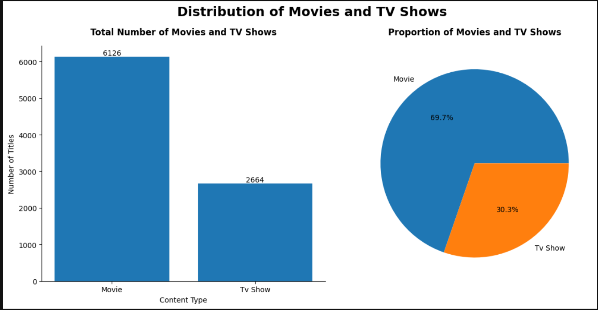
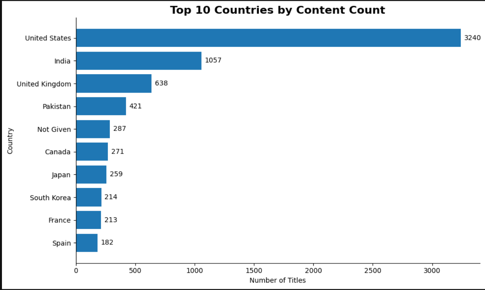
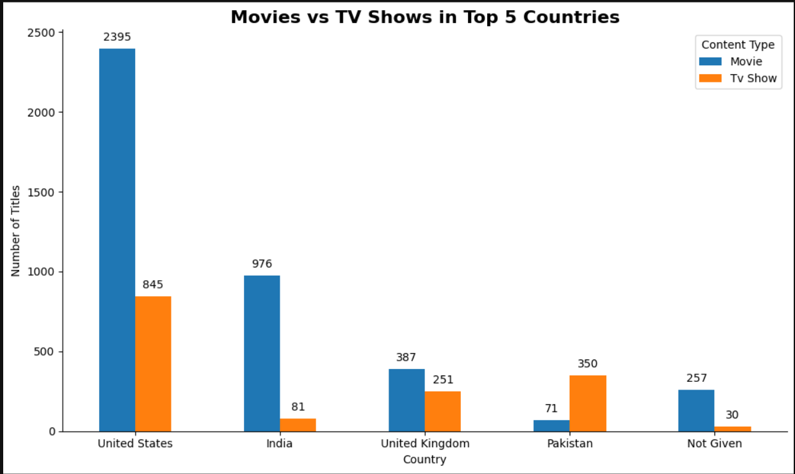
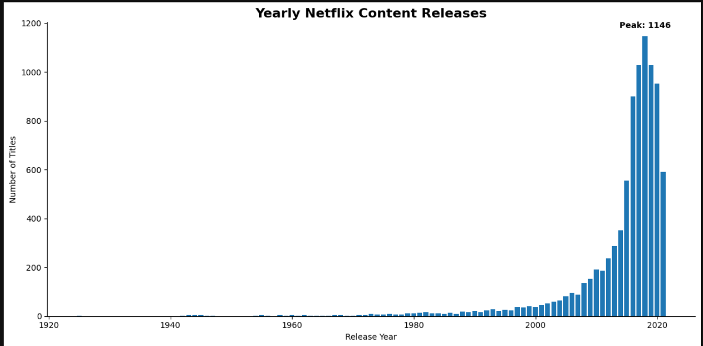

# Netflix Content Analysis

An exploratory data analysis project examining Netflix's content library to understand content distribution, country-wise title concentration, and release-year trends.

> **Internship Project:** This project was completed as part of my **Auspify Internship**. It demonstrates practical application of Python and data analysis techniques on a real-world entertainment dataset.


## 📌 Project Overview

Netflix has a large and diverse content library containing Movies and TV Shows from different countries and release years. This project analyzes the dataset to identify patterns in content type, geographic distribution, and release trends.

The analysis covers the complete workflow from **data cleaning and validation to exploratory analysis, visualization, and business insights**.

---

## 🎯 Business Objective

The objective of this project is to analyze Netflix's content catalog and identify meaningful patterns that can help understand:

* The distribution of Movies and TV Shows.
* Which countries have the highest number of titles in the dataset.
* How content distribution differs between Movies and TV Shows across major countries.
* How Netflix's content releases have changed over time.
* Major periods of content expansion and decline.

---

## ❓ Business Questions

1. What is the overall distribution of Movies and TV Shows?
2. Which countries have the highest number of Netflix titles?
3. How does the proportion of Movies and TV Shows vary across the top countries?
4. How has Netflix's content release volume changed over the years?
5. Which year recorded the highest number of content releases?

---

## 🛠️ Tools & Technologies

* **Python**
* **Pandas** — Data cleaning, transformation, aggregation, and analysis
* **Matplotlib** — Data visualization
* **Jupyter Notebook** — Analysis and documentation
* **GitHub** — Project version control and portfolio presentation

---

## 📂 Project Structure

```text
Netflix-Content-Analysis/
│
├── README.md
│
├── data/
│   ├── netflix_dataset.csv
│   └── cleaned_netflix_dataset.csv
│
├── notebooks/
│   ├── 01_Data_Cleaning.ipynb
│   ├── 02_Content_Distribution_Analysis.ipynb
│   ├── 03_Country_Wise_Content_Analysis.ipynb
│   └── 04_Release_Year_Trend_Analysis.ipynb
│
└── images/
    ├── content_distribution.png
    ├── top_10_countries.png
    ├── content_type_by_country.png
    └── content_release_trend.png
```

---

## 🔍 Analysis Performed

### 1. Data Cleaning

The original dataset was inspected and prepared for analysis.

Key checks included:

* Missing-value assessment
* Duplicate-record detection
* Data type and formatting validation
* Standardization of fields such as Country, Rating, and Type
* Creation of a cleaned dataset for subsequent analysis

The cleaned dataset was saved separately as:

`cleaned_netflix_dataset.csv`

---

### 2. Content Distribution Analysis

The cleaned dataset contains **8,790 titles**:

|Content Type|Number of Titles|Share|
|-|-:|-:|
|Movies|6,126|69.7%|
|TV Shows|2,664|30.3%|
|**Total**|**8,790**|**100%**|

### Visualization



### Key Insight

Movies represent approximately **70%** of the catalog, while TV Shows account for approximately **30%**. The dataset therefore has a substantially larger Movie presence.

---

### 3\. Country-wise Content Analysis

The analysis identified the countries associated with the highest number of titles in the dataset.

### Top Countries by Title Count

|Rank|Country|Content Count|
|-:|-|-:|
|1|United States|3,240|
|2|India|1,057|
|3|United Kingdom|638|
|4|Pakistan|421|
|5|Not Given|287|
|6|Canada|271|
|7|Japan|259|
|8|South Korea|214|
|9|France|213|
|10|Spain|182|

> **Note:** `Not Given` represents records where country information was unavailable and is not treated as a country in the interpretation.

### Visualization



### Movies vs TV Shows Across Top Countries

The country-wise analysis was further broken down by content type.

|Country|Movies|TV Shows|
|-|-:|-:|
|United States|2,395|845|
|India|976|81|
|United Kingdom|387|251|
|Pakistan|71|350|
|Not Given|257|30|



### Key Insights

* The United States has the highest number of titles in the dataset, with **3,240**.
* India ranks second with **1,057** titles.
* Movies dominate the catalog in the United States and India.
* Pakistan shows the opposite pattern, with **350 TV Shows compared with 71 Movies**.
* The United Kingdom has a comparatively more balanced mix of Movies and TV Shows.

> Country counts represent titles associated with each country in the dataset; they should not be interpreted as direct measurements of actual production volume.

---

### 4. Release Year Trend Analysis

The release-year analysis examined how the number of titles changed over time.

The dataset shows strong growth in content releases from the early 2010s, followed by a peak in 2018.

### Peak Release Year

**2018 — 1,146 titles**



### Key Insights

* Netflix content releases increased strongly from **2012 to 2018**.
* The most notable growth occurred during **2015 and 2016**.
* Content releases reached their highest recorded level in **2018**, with **1,146 titles**.
* Releases declined to **1,030 titles in 2019** and **953 titles in 2020**.
* The dataset contains **592 titles for 2021**; this lower figure may reflect incomplete data for that year and should not be interpreted as a definitive full-year decline.
* Overall, the dataset indicates a period of significant content expansion followed by a decline after the 2018 peak.

---

## 📊 Key Findings

1. **Movies dominate the catalog:** 6,126 Movies account for approximately **69.7%** of all titles, compared with 2,664 TV Shows.
2. **The United States leads by title count:** It has **3,240 titles**, substantially more than the next-highest country, India.
3. **India has a strong Movie presence:** The dataset contains **976 Movies and 81 TV Shows** associated with India.
4. **Pakistan has a TV Show-heavy mix:** Pakistan has **350 TV Shows versus 71 Movies**, making it a notable exception to the broader Movie-dominant pattern.
5. **2018 was the peak release year:** The dataset records **1,146 titles** released in 2018.
6. **Content expansion accelerated during the mid-2010s:** Releases increased particularly sharply in 2015 and 2016 before reaching the 2018 peak.

---

## 💼 Business Insights & Recommendations

Based on the analysis, several observations can be made:

* **Content strategy:** The strong Movie share suggests that Movies form a major component of the analyzed catalog. However, the substantial TV Show presence indicates that serialized content is also an important part of the library.
* **Regional content:** The large title counts associated with the United States and India highlight the importance of these markets within the dataset.
* **Regional preferences:** The different Movie/TV Show patterns across countries suggest that content strategies may benefit from considering regional viewing preferences.
* **Trend monitoring:** The rapid increase in releases during the mid-to-late 2010s suggests a period of aggressive catalog expansion. Tracking release trends can help evaluate changes in content strategy over time.
* **Data quality:** Missing country information (`Not Given`) should ideally be improved in future datasets because incomplete geographic information limits regional analysis.

> These recommendations are analytical observations from the dataset and should be combined with additional business, audience, and financial data before making operational decisions.

---

## 📁 Dataset

The original dataset was provided through a **Google Drive link included in the internship offer letter**.

For reproducibility, both versions are included in the repository:

* `netflix_dataset.csv` — Original dataset
* `cleaned_netflix_dataset.csv` — Dataset after data cleaning and standardization

---

## 🚀 How to Use

### 1. Clone the repository

```bash
git clone https://github.com/Hrs-ML/netflix-content-analysis
cd netflix-content-analysis
```

### 2. Install dependencies

```bash
pip install pandas matplotlib jupyter
```

### 3. Run the notebooks

Open Jupyter Notebook:

```bash
jupyter notebook
```

Then run the notebooks in the following order:

1. `01_Data_Cleaning.ipynb`
2. `02_Content_Distribution_Analysis.ipynb`
3. `03_Country_Wise_Content_Analysis.ipynb`
4. `04_Release_Year_Trend_Analysis.ipynb`

---

## 📈 Project Outcome

This project demonstrates an end-to-end exploratory data analysis workflow using Python, starting with raw data and progressing through cleaning, aggregation, visualization, interpretation, and business-oriented insights.

The analysis provides a clear view of Netflix's content mix, geographic concentration, and historical release patterns while demonstrating practical skills in **Pandas, data cleaning, exploratory analysis, and Matplotlib visualization**.

---

## 👤 Author

**HARSH KUMAR**

Data Analyst | Python | SQL | Excel | Power BI

This project was completed as part of my **Auspify Internship**.

